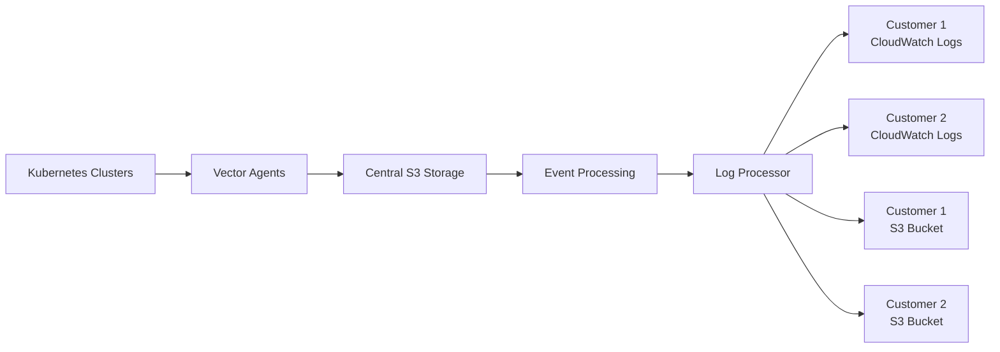

# Multi-Tenant Logging Pipeline

A **proof-of-concept** implementation of a scalable, cost-effective multi-tenant logging pipeline on AWS that implements "Centralized Ingestion, Decentralized Delivery" architecture.

## 🚀 What This Does

- **Collects logs** from Kubernetes/OpenShift clusters using Vector agents
- **Stores logs centrally** in S3 with intelligent compression and partitioning  
- **Delivers logs** to multiple customer AWS accounts simultaneously
- **Supports multiple delivery types** per tenant (CloudWatch Logs + S3)
- **Reduces costs** by ~90% compared to direct CloudWatch Logs ingestion

## 🏗️ Architecture Overview



**Key Benefits:**
- **Multi-Delivery**: Each tenant can receive logs via CloudWatch Logs AND S3 simultaneously
- **Direct S3 Writes**: Eliminates Kinesis Firehose costs (~$50/TB saved)
- **Cross-Account Security**: Secure delivery using IAM role assumption
- **Container-Based Processing**: Modern Lambda functions using ECR containers

## 📚 Documentation

### Quick Start
- **🚀 [5-Minute Setup](docs/deployment-guide.md)** - Get running quickly
- **🏗️ [Architecture Deep Dive](DESIGN.md)** - Comprehensive system design
- **💻 [Development Guide](CLAUDE.md)** - Local development and testing

### Component Guides
- **☁️ [Infrastructure Deployment](cloudformation/README.md)** - CloudFormation templates
- **🚢 [Kubernetes Deployment](k8s/README.md)** - Vector and processor deployment
- **🔌 [API Management](api/README.md)** - Tenant configuration API
- **🐛 [Troubleshooting](docs/troubleshooting.md)** - Common issues and solutions

## 🎯 Quick Start

### Prerequisites
- AWS CLI configured with appropriate permissions
- S3 bucket for storing CloudFormation templates  
- kubectl configured for your Kubernetes clusters
- Python 3.13+ and Podman for local development

### 1. Deploy Infrastructure
```bash
# Deploy global infrastructure (one-time)
cd cloudformation/
./deploy.sh -t global

# Deploy regional infrastructure with processing
./deploy.sh -t regional \
  -b your-cloudformation-templates-bucket \
  --central-role-arn arn:aws:iam::123456789012:role/ROSA-CentralLogDistributionRole-abcd1234 \
  --include-sqs --include-lambda \
  --ecr-image-uri 123456789012.dkr.ecr.us-east-1.amazonaws.com/log-processor:latest
```

### 2. Deploy Vector to Kubernetes
```bash
# Create logging namespace
kubectl create namespace logging

# Deploy Vector collector (OpenShift with specific overlay)
kubectl apply -k k8s/collector/overlays/cuppett

# Verify deployment
kubectl get pods -n logging
```

### 3. Configure Tenants
```bash
# Add tenant configuration to DynamoDB
aws dynamodb put-item \
  --table-name multi-tenant-logging-development-tenant-configs \
  --item '{
    "tenant_id": {"S": "acme-corp"},
    "type": {"S": "cloudwatch"},
    "log_distribution_role_arn": {"S": "arn:aws:iam::123456789012:role/LogDistributionRole"},
    "log_group_name": {"S": "/aws/logs/acme-corp"},
    "target_region": {"S": "us-east-1"},
    "enabled": {"BOOL": true},
    "groups": {"SS": ["API", "Authentication"]}
  }'
```

**📖 [Complete Deployment Guide](docs/deployment-guide.md)**

## 🔧 Development

### Local Testing
```bash
# Source environment variables
source .env

# Test log processor directly
cd container/
python3 log_processor.py --mode sqs

# Test with containers
podman build -f Containerfile.processor -t log-processor:latest .
podman run --rm -e AWS_PROFILE=your-profile log-processor:latest
```

### Container Architecture
- **Collector Container**: Base container with Vector binary
- **Processor Container**: Multi-stage build including Vector for CloudWatch delivery
- **Multi-Mode Support**: Lambda runtime, SQS polling, and manual testing

**💻 [Full Development Guide](CLAUDE.md)**

## 🎛️ Current Capabilities

### ✅ Implemented Features
- [x] **Vector log collection** with namespace filtering and intelligent parsing
- [x] **Direct S3 storage** with GZIP compression and dynamic partitioning
- [x] **Multi-delivery support** - CloudWatch Logs + S3 per tenant
- [x] **Application filtering** with individual apps and pre-defined groups (API, Authentication, etc.)
- [x] **Container-based Lambda** processing with ECR images
- [x] **Cross-account security** via double-hop role assumption
- [x] **Cost optimization** with S3 lifecycle policies and compression
- [x] **Development tools** with fake log generator and local testing
- [x] **API management** for tenant configuration via REST API

### 🚧 Proof-of-Concept Limitations
- **Basic monitoring** - AWS native services only (no custom metrics/dashboards)
- **Simple error handling** - DLQ and retry logic without advanced workflow
- **Regional deployment** - Manual multi-region setup required
- **Minimal UI** - Configuration via API/CLI only

## 📊 Performance & Costs

### Estimated Monthly Costs (1TB logs)
- **This Pipeline**: ~$50/month (S3 + Lambda + supporting services)
- **Direct CloudWatch**: ~$500/month (ingestion costs)
- **Kinesis Firehose**: ~$100/month (additional processing costs)

### Performance Characteristics
- **Throughput**: ~20,000 events/second per cluster node
- **Latency**: ~2-5 minutes from log generation to delivery
- **Compression**: ~30:1 ratio with GZIP
- **Scalability**: Horizontal scaling via multiple processor instances

## 🔒 Security Model

- **Namespace Isolation**: Vector only collects from labeled namespaces
- **Cross-Account Access**: Customer roles with ExternalId validation
- **Encryption**: SSE-S3/KMS encryption for all data at rest
- **Least Privilege**: Minimal IAM permissions with resource restrictions
- **Audit Trail**: All role assumptions logged in CloudTrail

## 🤝 Contributing

1. Check [Development Guide](CLAUDE.md) for local setup
2. Review [Architecture Design](DESIGN.md) for system understanding
3. Test changes in development environment first
4. Submit pull requests with detailed descriptions

## 📄 License

This project is licensed under the MIT License - see the LICENSE file for details.

---

**🏗️ POC Status**: This project demonstrates core functionality with minimal complexity. Advanced monitoring, alerting, and management features should be added incrementally after pipeline validation.