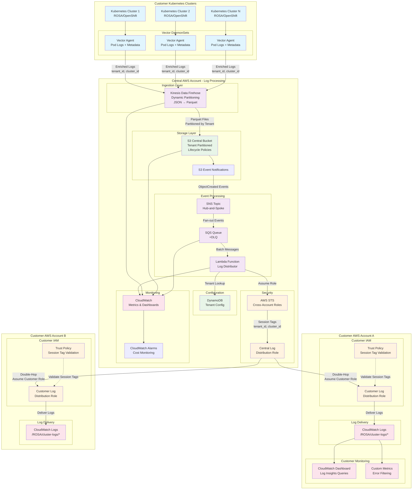

# Multi-Tenant Logging Pipeline

This repository contains the implementation of a scalable, multi-tenant logging pipeline on AWS as described in the [DESIGN.md](../DESIGN.md) document.

## Architecture Overview

The solution implements a "Centralized Ingestion, Decentralized Delivery" model with the following key components:

- **Vector** log agents deployed as DaemonSets in Kubernetes clusters
- **Kinesis Data Firehose** for centralized ingestion with dynamic partitioning
- **S3** for staging and long-term storage with lifecycle policies
- **SNS/SQS** hub-and-spoke pattern for event-driven processing
- **Lambda** function for cross-account log delivery
- **DynamoDB** for tenant configuration management

### AWS Architecture Diagram



### Data Flow Summary

1. **Collection**: Vector agents collect logs from Kubernetes pods and enrich with tenant metadata
2. **Ingestion**: Kinesis Firehose receives logs and applies dynamic partitioning by tenant
3. **Staging**: S3 stores logs in Parquet format with tenant-segregated partitions
4. **Notification**: S3 events trigger SNS hub, which distributes to SQS queue
5. **Processing**: Lambda function processes SQS messages and delivers logs cross-account
6. **Security**: Double-hop role assumption with session tag validation ensures tenant isolation
7. **Delivery**: Logs delivered to customer CloudWatch Logs in `/ROSA/cluster-logs/*` format

## Repository Structure

```
├── cloudformation/
│   ├── main.yaml                          # Main CloudFormation orchestration template
│   ├── core-infrastructure.yaml           # S3, DynamoDB, KMS, IAM resources
│   ├── kinesis-stack.yaml                 # Firehose delivery stream and Glue catalog
│   ├── lambda-stack.yaml                  # Lambda functions and event mappings
│   ├── monitoring-stack.yaml              # CloudWatch, SNS/SQS, and alerting
│   ├── customer-log-distribution-role.yaml # Customer account CloudFormation template
│   ├── deploy.sh                          # CloudFormation deployment script
│   ├── MIGRATION_GUIDE.md                 # Migration from Terraform guide
│   └── README.md                          # CloudFormation-specific documentation
├── docs/
│   └── README.md                          # This file
├── k8s/
│   ├── vector-config.yaml                # Vector ConfigMap
│   └── vector-daemonset.yaml             # Vector DaemonSet deployment
├── lambda/
│   ├── log_distributor.py                # Main Lambda function
│   └── requirements.txt                  # Python dependencies
└── DESIGN.md                             # Comprehensive architecture design
```

## Quick Start

### Prerequisites

- AWS CLI configured with appropriate permissions
- S3 bucket for storing CloudFormation templates
- kubectl configured for your Kubernetes clusters
- Python 3.11+ (for Lambda development)

### 1. Deploy Core Infrastructure

```bash
cd cloudformation/

# Deploy with minimal configuration
./deploy.sh -b your-cloudformation-templates-bucket

# Deploy to staging environment
./deploy.sh -e staging -b your-cloudformation-templates-bucket

# Deploy with custom parameters
./deploy.sh -e production -p my-logging-project -r us-west-2 -b my-templates-bucket
```

### 2. Deploy Vector to Kubernetes

```bash
# Create logging namespace
kubectl create namespace logging

# Deploy Vector configuration
kubectl apply -f k8s/vector-config.yaml
kubectl apply -f k8s/vector-daemonset.yaml
```

### 3. Package and Deploy Lambda Function

```bash
cd lambda/
pip install -r requirements.txt -t .
zip -r log_distributor.zip .
aws lambda update-function-code \
  --function-name log-distributor \
  --zip-file fileb://log_distributor.zip
```

### 4. Onboard Customer Accounts

Provide customers with the CloudFormation template:

```bash
aws cloudformation create-stack \
  --stack-name customer-logging-infrastructure \
  --template-body file://cloudformation/customer-log-distribution-role.yaml \
  --parameters ParameterKey=CentralLogDistributionRoleArn,ParameterValue=arn:aws:iam::CENTRAL-ACCOUNT:role/CentralLogDistributionRole \
               ParameterKey=LogRetentionDays,ParameterValue=90 \
  --capabilities CAPABILITY_NAMED_IAM
```

## CloudFormation Infrastructure

This project uses CloudFormation for infrastructure deployment with a nested stack architecture:

- **CloudFormation**: Nested stack architecture with comprehensive parameter management, validation, and rollback capabilities. Includes automated deployment scripts. See [cloudformation/README.md](../cloudformation/README.md) for detailed documentation.

### Migration from Terraform

If you previously used Terraform with this project, see [cloudformation/MIGRATION_GUIDE.md](../cloudformation/MIGRATION_GUIDE.md) for migration instructions. The Terraform code has been removed in favor of CloudFormation.

## Configuration

### Environment Variables

The following environment variables can be configured:

- `AWS_REGION`: AWS region for deployment (default: us-east-1)
- `KINESIS_STREAM_NAME`: Name of the Firehose stream
- `TENANT_CONFIG_TABLE`: DynamoDB table name for tenant configurations

### CloudFormation Parameters

Key parameters for customization:

```json
{
  "Environment": "production",
  "ProjectName": "multi-tenant-logging",
  "LambdaReservedConcurrency": 100,
  "FirehoseBufferSizeMB": 128,
  "EnableS3Encryption": true,
  "EnableDetailedMonitoring": true,
  "AlertEmailEndpoints": "ops@company.com",
  "CostCenter": "platform-engineering"
}
```

## Monitoring and Alerts

The infrastructure includes comprehensive monitoring:

### CloudWatch Dashboards
- **Multi-tenant logging overview**: System-wide metrics
- **Per-tenant dashboards**: Individual tenant monitoring

### CloudWatch Alarms
- Firehose delivery failures
- Lambda function errors and duration
- SQS queue depth and message age
- DynamoDB throttling
- Dead letter queue messages

### Cost Monitoring
- AWS Cost Budget alerts
- Cost anomaly detection
- Resource tagging for cost allocation

## Security

### Cross-Account Access
- Attribute-Based Access Control (ABAC) with session tags
- Least-privilege IAM policies
- Temporary credentials with STS AssumeRole

### Data Encryption
- Server-side encryption for S3 buckets
- KMS encryption for SNS/SQS messages
- Encryption in transit for all data transfers

### Network Security
- VPC endpoints for service communication (optional)
- Security groups and NACLs for network isolation

## Performance Optimization

### Batching and Aggregation
- Firehose buffer configuration: 128MB / 15 minutes
- Lambda SQS batch size: 10 messages
- CloudWatch Logs API batching: 1000 events

### Format Conversion
- Parquet format for 80-90% storage cost reduction
- GZIP compression for data transfer optimization
- Dynamic partitioning for query performance

### Concurrency Management
- Lambda reserved concurrency: 100
- SQS visibility timeout: 15 minutes
- Dead letter queue for error handling

## Cost Management

### Estimated Costs (1TB/month)
- Kinesis Data Firehose: ~$50
- S3 storage (with lifecycle): ~$25
- Lambda execution: ~$15
- SNS/SQS: ~$5
- DynamoDB: ~$5
- **Total: ~$100/month** (vs $600+ for direct CloudWatch Logs)

### Cost Optimization Features
- S3 lifecycle policies with tiered storage
- Parquet format conversion
- Intelligent tiering
- Right-sized Lambda memory allocation

## Troubleshooting

### Common Issues

1. **Vector not sending logs**
   - Check IAM role permissions for Firehose
   - Verify Kubernetes RBAC configuration
   - Check Vector pod logs: `kubectl logs -n logging daemonset/vector-logs`

2. **Lambda function errors**
   - Check CloudWatch Logs: `/aws/lambda/log-distributor`
   - Verify DynamoDB tenant configuration
   - Check cross-account role trust policies

3. **High costs**
   - Review Firehose buffer settings
   - Check S3 lifecycle policies
   - Monitor CloudWatch billing alerts

### Debug Commands

```bash
# Check Vector status
kubectl get pods -n logging
kubectl describe daemonset vector-logs -n logging

# Check Lambda metrics
aws cloudwatch get-metric-statistics \
  --namespace AWS/Lambda \
  --metric-name Errors \
  --dimensions Name=FunctionName,Value=log-distributor \
  --start-time 2024-01-01T00:00:00Z \
  --end-time 2024-01-01T23:59:59Z \
  --period 3600 \
  --statistics Sum

# Check Firehose status
aws firehose describe-delivery-stream \
  --delivery-stream-name central-logging-stream
```

## Development

### Local Testing

```bash
# Test Lambda function locally
cd lambda/
python -m pytest tests/

# Validate CloudFormation templates
cd cloudformation/
./deploy.sh --validate-only -b your-templates-bucket
```

### Contributing

1. Follow the existing code structure
2. Update documentation for any changes
3. Test in a development environment first
4. Submit pull requests with detailed descriptions

## Support

For issues and questions:
- Check the troubleshooting guide above
- Review CloudWatch logs and metrics
- Consult the [DESIGN.md](../DESIGN.md) for architectural details
- Open an issue in the repository

## License

This project is licensed under the MIT License - see the LICENSE file for details.