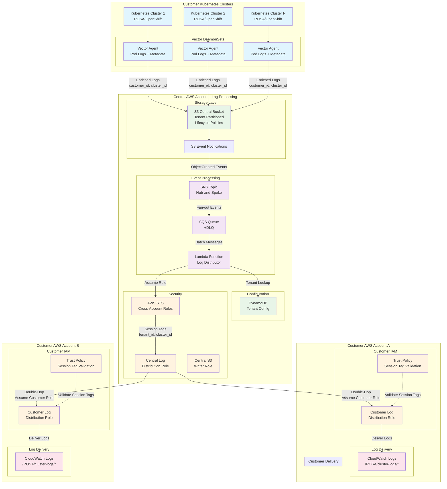

# Multi-Tenant Logging Pipeline

This repository contains the implementation of a scalable, multi-tenant logging pipeline on AWS as described in the [DESIGN.md](../DESIGN.md) document.

## Architecture Overview

The solution implements a "Centralized Ingestion, Decentralized Delivery" model with a modern container-based processing architecture:

- **Vector** log agents deployed as DaemonSets in Kubernetes clusters
- **S3** for direct log storage with dynamic partitioning by tenant
- **SNS/SQS** hub-and-spoke pattern for event-driven processing
- **Container-based Lambda** functions for cross-account log delivery using ECR images
- **DynamoDB** for tenant configuration management
- **Unified log processor** supporting Lambda, SQS polling, and manual execution modes

### AWS Architecture Diagram



### Data Flow Summary

1. **Collection**: Vector agents collect logs from Kubernetes pods and enrich with tenant metadata
2. **Direct Write**: Vector writes logs directly to S3 with dynamic partitioning by customer_id/cluster_id/application/pod_name
3. **Notification**: S3 events trigger SNS hub, which distributes to SQS queue
4. **Processing**: Lambda function processes SQS messages and delivers logs cross-account
5. **Security**: Double-hop role assumption with session tag validation ensures tenant isolation
6. **Delivery**: Logs delivered to customer CloudWatch Logs in `/ROSA/cluster-logs/*` format

## Repository Structure

```
├── cloudformation/
│   ├── main.yaml                          # Main CloudFormation orchestration template
│   ├── core-infrastructure.yaml           # S3, DynamoDB, KMS, IAM resources
│   ├── sqs-stack.yaml                     # Optional SQS queue and DLQ
│   ├── lambda-stack.yaml                  # Optional container-based Lambda functions
│   ├── customer-log-distribution-role.yaml # Customer account CloudFormation template
│   ├── deploy.sh                          # CloudFormation deployment script with modular options
│   └── README.md                          # CloudFormation-specific documentation
├── container/
│   ├── Containerfile                      # Container definition for unified log processor
│   ├── log_processor.py                   # Unified log processor (Lambda/SQS/manual modes)
│   ├── entrypoint.sh                      # Multi-mode container entrypoint
│   └── requirements.txt                   # Python dependencies
├── docs/
│   └── README.md                          # This file
├── k8s/
│   ├── vector-config.yaml                # Vector ConfigMap
│   └── vector-daemonset.yaml             # Vector DaemonSet deployment
├── .env.sample                           # Environment variable template
├── .gitignore                            # Git ignore with security exclusions
├── CLAUDE.md                             # Local development and usage guide
└── DESIGN.md                             # Comprehensive architecture design
```

## Quick Start

### Prerequisites

- AWS CLI configured with appropriate permissions
- S3 bucket for storing CloudFormation templates
- kubectl configured for your Kubernetes clusters
- Python 3.11+ (for Lambda development)

### 1. Deploy Infrastructure

The infrastructure supports three deployment patterns:

#### **Core Infrastructure Only**
```bash
cd cloudformation/
./deploy.sh -b your-cloudformation-templates-bucket
```

#### **Core + SQS for External Processing**
```bash
cd cloudformation/
./deploy.sh -b your-cloudformation-templates-bucket --include-sqs
```

#### **Full Container-Based Lambda Processing**
```bash
# First, build and push container to ECR
cd container/
podman build -f Containerfile -t log-processor:latest .
aws ecr get-login-password --region YOUR_AWS_REGION | podman login --username AWS --password-stdin AWS_ACCOUNT_ID.dkr.ecr.YOUR_AWS_REGION.amazonaws.com
podman tag log-processor:latest AWS_ACCOUNT_ID.dkr.ecr.YOUR_AWS_REGION.amazonaws.com/log-processor:latest
podman push AWS_ACCOUNT_ID.dkr.ecr.YOUR_AWS_REGION.amazonaws.com/log-processor:latest

# Deploy infrastructure with Lambda processing
cd ../cloudformation/
./deploy.sh -b your-templates-bucket --include-sqs --include-lambda --ecr-image-uri AWS_ACCOUNT_ID.dkr.ecr.YOUR_AWS_REGION.amazonaws.com/log-processor:latest
```

#### **Environment-Specific Deployment**
```bash
# Deploy to staging environment
./deploy.sh -e staging -b your-templates-bucket --include-sqs --include-lambda --ecr-image-uri ECR_IMAGE_URI

# Deploy with custom parameters and environment variables
export AWS_PROFILE=your-profile
export AWS_REGION=YOUR_AWS_REGION
./deploy.sh -e production -p my-logging-project -b my-templates-bucket --include-sqs --include-lambda --ecr-image-uri ECR_IMAGE_URI
```

### 2. Deploy Vector to Kubernetes

```bash
# Create logging namespace
kubectl create namespace logging

# Deploy Vector configuration
kubectl apply -f k8s/vector-config.yaml
kubectl apply -f k8s/vector-daemonset.yaml
```

### 3. Local Development and Testing

The container-based architecture enables comprehensive local development:

#### **Direct Python Execution**
```bash
cd container/
pip3 install --user -r requirements.txt

# Set up environment variables (copy from .env.sample)
export AWS_PROFILE=YOUR_AWS_PROFILE
export AWS_REGION=YOUR_AWS_REGION
export TENANT_CONFIG_TABLE=multi-tenant-logging-development-tenant-configs
export CENTRAL_LOG_DISTRIBUTION_ROLE_ARN=arn:aws:iam::AWS_ACCOUNT_ID:role/role-name
export SQS_QUEUE_URL=https://sqs.YOUR_AWS_REGION.amazonaws.com/AWS_ACCOUNT_ID/queue-name

# Test SQS polling mode
python3 log_processor.py --mode sqs

# Test manual mode with sample data
echo '{"Message": "{\"Records\": [{\"s3\": {\"bucket\": {\"name\": \"test-bucket\"}, \"object\": {\"key\": \"test-customer/test-cluster/test-app/test-pod/20240101-test.json.gz\"}}}]}"}' | python3 log_processor.py --mode manual
```

#### **Container Testing**
```bash
# Build container
cd container/
podman build -f Containerfile -t log-processor:latest .

# Test with AWS profile
podman run --rm \
  -e AWS_PROFILE=YOUR_AWS_PROFILE \
  -e EXECUTION_MODE=sqs \
  -v ~/.aws:/home/logprocessor/.aws:ro \
  log-processor:latest

# Test with explicit credentials
export AWS_ACCESS_KEY_ID=$(aws configure get aws_access_key_id --profile YOUR_AWS_PROFILE)
export AWS_SECRET_ACCESS_KEY=$(aws configure get aws_secret_access_key --profile YOUR_AWS_PROFILE)
podman run --rm \
  -e AWS_ACCESS_KEY_ID="$AWS_ACCESS_KEY_ID" \
  -e AWS_SECRET_ACCESS_KEY="$AWS_SECRET_ACCESS_KEY" \
  -e EXECUTION_MODE=manual \
  log-processor:latest
```

### 4. Container Registry Management

#### **ECR Repository Setup**
```bash
# Create ECR repository if it doesn't exist
aws ecr create-repository --repository-name log-processor --region YOUR_AWS_REGION

# Get repository URI
aws ecr describe-repositories --repository-names log-processor --region YOUR_AWS_REGION --query 'repositories[0].repositoryUri' --output text
```

#### **Container Lifecycle Management**
```bash
# Build and tag with version
cd container/
podman build -f Containerfile -t log-processor:v1.0.0 .
podman tag log-processor:v1.0.0 log-processor:latest

# Tag for ECR
ECR_URI=$(aws ecr describe-repositories --repository-names log-processor --region YOUR_AWS_REGION --query 'repositories[0].repositoryUri' --output text)
podman tag log-processor:latest $ECR_URI:latest
podman tag log-processor:v1.0.0 $ECR_URI:v1.0.0

# Push to ECR
aws ecr get-login-password --region YOUR_AWS_REGION | podman login --username AWS --password-stdin $ECR_URI
podman push $ECR_URI:latest
podman push $ECR_URI:v1.0.0
```

### 5. Onboard Customer Accounts

Provide customers with the CloudFormation template:

```bash
aws cloudformation create-stack \
  --stack-name customer-logging-infrastructure \
  --template-body file://cloudformation/customer-log-distribution-role.yaml \
  --parameters ParameterKey=CentralLogDistributionRoleArn,ParameterValue=arn:aws:iam::CENTRAL-ACCOUNT:role/CentralLogDistributionRole \
               ParameterKey=LogRetentionDays,ParameterValue=90 \
  --capabilities CAPABILITY_NAMED_IAM
```

## CloudFormation Infrastructure

This project uses CloudFormation for infrastructure deployment with a modular nested stack architecture providing comprehensive parameter management, validation, and rollback capabilities. See [cloudformation/README.md](../cloudformation/README.md) for detailed deployment documentation.

### Recent Infrastructure Updates

The CloudFormation templates have undergone major architectural improvements:
- **Container-Based Lambda**: Unified log processor using ECR container images with multi-mode execution
- **Modular Deployment**: Optional SQS and Lambda stacks with `--include-sqs` and `--include-lambda` flags
- **Native S3 Notifications**: Replaced custom Lambda functions with native AWS capabilities
- **ECR Integration**: Container images stored in Amazon Elastic Container Registry for Lambda deployment
- **Simplified Infrastructure**: Reduced complexity through container-based approach
- **Enhanced Deployment**: Improved deployment script with conditional stack selection

Previous fixes included:
- **IAM Policy Fixes**: Corrected S3 bucket ARN format in IAM policies to use proper CloudFormation intrinsic functions
- **Template URL Format**: Updated nested stack URLs to use the legacy S3 format (`https://s3.amazonaws.com/bucket/key`) required by CloudFormation
- **Resource Type Validation**: Removed invalid `AWS::DynamoDB::Item` resources that aren't supported by CloudFormation
- **Encryption Configuration**: Fixed DynamoDB SSE configuration to include required `SSEType` parameter
- **Environment Variable Support**: Deployment script now properly honors `AWS_PROFILE` and `AWS_REGION` environment variables

## Configuration

### Environment Variables

The following environment variables can be configured:

- `AWS_REGION`: AWS region for deployment (default: us-east-1)
- `S3_BUCKET_NAME`: Name of the central S3 bucket for logs
- `S3_WRITER_ROLE_ARN`: ARN of the S3 writer role for Vector
- `TENANT_CONFIG_TABLE`: DynamoDB table name for tenant configurations

### CloudFormation Parameters

Key parameters for customization:

```json
{
  "Environment": "production",
  "ProjectName": "multi-tenant-logging",
  "LambdaReservedConcurrency": 100,
  "EnableS3Encryption": true
}
```

## Monitoring and Observability

The infrastructure provides basic observability through AWS native services:

### CloudWatch Logs
- **Lambda Function Logs**: Automatic logging of processing events and errors
- **Customer Log Delivery**: Logs delivered to customer CloudWatch Logs accounts

### Resource Tagging
- All resources tagged with Environment, Project, and StackType for organization
- Enables cost tracking and resource management

### Built-in AWS Monitoring
- Standard AWS service metrics available through AWS Console
- S3 bucket metrics, Lambda execution metrics, SQS queue metrics
- DynamoDB operational metrics

## Security

### Cross-Account Access
- Attribute-Based Access Control (ABAC) with session tags
- Least-privilege IAM policies
- Temporary credentials with STS AssumeRole

### Data Encryption
- Server-side encryption for S3 buckets
- KMS encryption for SNS/SQS messages
- Encryption in transit for all data transfers

### Network Security
- VPC endpoints for service communication (optional)
- Security groups and NACLs for network isolation

## Performance Optimization

### Batching and Aggregation
- Vector S3 batch configuration: 10MB / 5 minutes
- Lambda SQS batch size: 10 messages
- CloudWatch Logs API batching: 1000 events

### Format Conversion
- GZIP compression for storage and transfer optimization
- Dynamic partitioning by customer/cluster/app for query performance

### Concurrency Management
- Lambda reserved concurrency: 100
- SQS visibility timeout: 15 minutes
- Dead letter queue for error handling

## Cost Management

### Estimated Costs (1TB/month)
- S3 storage (with lifecycle): ~$25
- Lambda execution: ~$15
- SNS/SQS: ~$5
- DynamoDB: ~$5
- **Total: ~$50/month** (vs $600+ for direct CloudWatch Logs)

### Cost Optimization Features
- S3 lifecycle policies with tiered storage
- GZIP compression
- Intelligent tiering
- Right-sized Lambda memory allocation

## Troubleshooting

### Common Issues

1. **Vector not sending logs**
   - Check IAM role permissions for S3
   - Verify S3WriterRole trust policy
   - Check Vector pod logs: `kubectl logs -n logging daemonset/vector-logs`

2. **Lambda function errors**
   - Check CloudWatch Logs: `/aws/lambda/log-distributor`
   - Verify DynamoDB tenant configuration
   - Check cross-account role trust policies

3. **High costs**
   - Review Vector batch settings
   - Check S3 lifecycle policies
   - Monitor CloudWatch billing alerts

### Debug Commands

```bash
# Check Vector status
kubectl get pods -n logging
kubectl describe daemonset vector-logs -n logging

# Check Lambda metrics
aws cloudwatch get-metric-statistics \
  --namespace AWS/Lambda \
  --metric-name Errors \
  --dimensions Name=FunctionName,Value=log-distributor \
  --start-time 2024-01-01T00:00:00Z \
  --end-time 2024-01-01T23:59:59Z \
  --period 3600 \
  --statistics Sum

# Check S3 bucket metrics
aws cloudwatch get-metric-statistics \
  --namespace AWS/S3 \
  --metric-name NumberOfObjects \
  --dimensions Name=BucketName,Value=multi-tenant-logging-production-central \
  --start-time 2024-01-01T00:00:00Z \
  --end-time 2024-01-01T23:59:59Z \
  --period 3600 \
  --statistics Average
```

## Development

### Local Testing

#### **Log Processor Testing**
```bash
# Test unified log processor locally (direct Python)
cd container/
python3 log_processor.py --mode manual

# Test with container (SQS polling)
podman build -f Containerfile -t log-processor:latest .
podman run --rm -e EXECUTION_MODE=sqs -v ~/.aws:/home/logprocessor/.aws:ro log-processor:latest
```

#### **Vector Pipeline Testing with Fake Log Generator**
```bash
# Install fake log generator dependencies
cd test_container/
pip3 install -r requirements.txt

# Basic Vector test with realistic fake logs
python3 fake_log_generator.py --total-batches 10 | vector --config ../vector-local-test.yaml

# High-volume performance test
python3 fake_log_generator.py \
  --min-batch-size 50 --max-batch-size 100 \
  --min-sleep 0.1 --max-sleep 0.5 \
  --total-batches 100 | vector --config ../vector-local-test.yaml

# Multi-tenant testing with specific metadata
python3 fake_log_generator.py \
  --customer-id acme-corp \
  --cluster-id prod-cluster-1 \
  --application payment-service \
  --total-batches 20 | vector --config ../vector-local-test.yaml

# Container-based testing
podman build -f Containerfile -t fake-log-generator .
podman run --rm fake-log-generator --total-batches 10 | vector --config ../vector-local-test.yaml

# Use automated test script
./test-vector.sh
```

#### **Infrastructure Validation**
```bash
# Validate CloudFormation templates
cd cloudformation/
./deploy.sh --validate-only -b your-templates-bucket

# Test modular deployment options
./deploy.sh --validate-only -b your-templates-bucket --include-sqs
./deploy.sh --validate-only -b your-templates-bucket --include-sqs --include-lambda --ecr-image-uri ECR_URI
```

### Contributing

1. Follow the existing code structure
2. Update documentation for any changes
3. Test in a development environment first
4. Submit pull requests with detailed descriptions

## Support

For issues and questions:
- Check the troubleshooting guide above
- Review CloudWatch logs and metrics
- Consult the [DESIGN.md](../DESIGN.md) for architectural details
- Open an issue in the repository

## License

This project is licensed under the MIT License - see the LICENSE file for details.