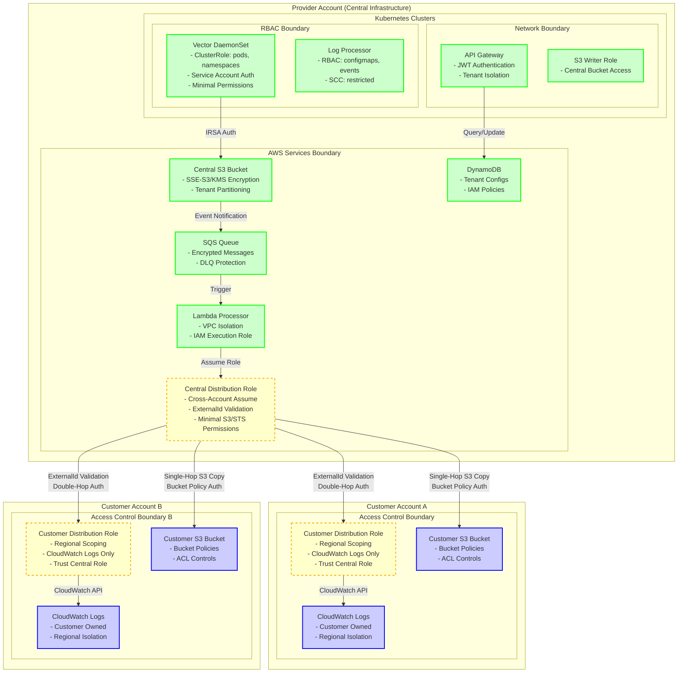
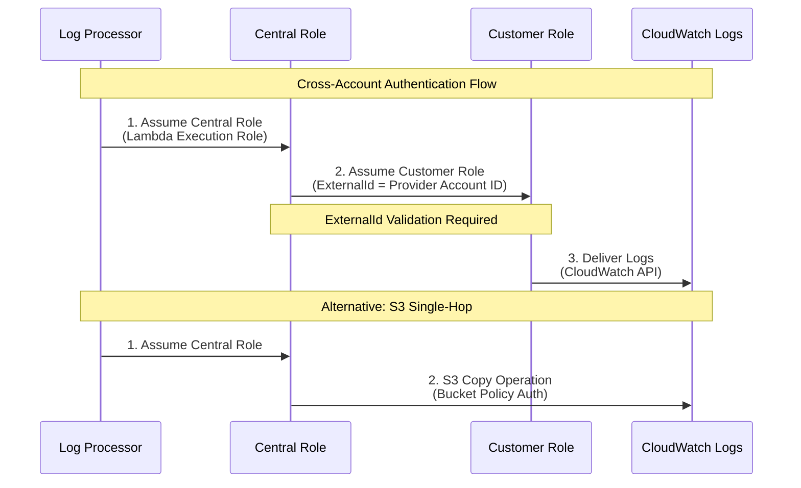
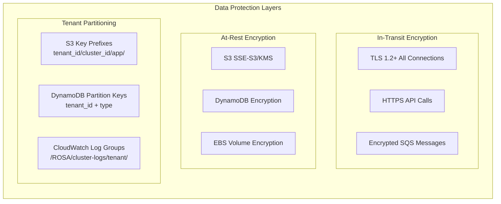
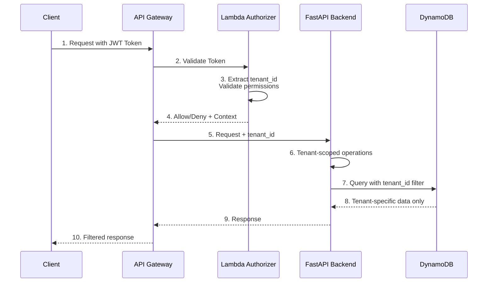
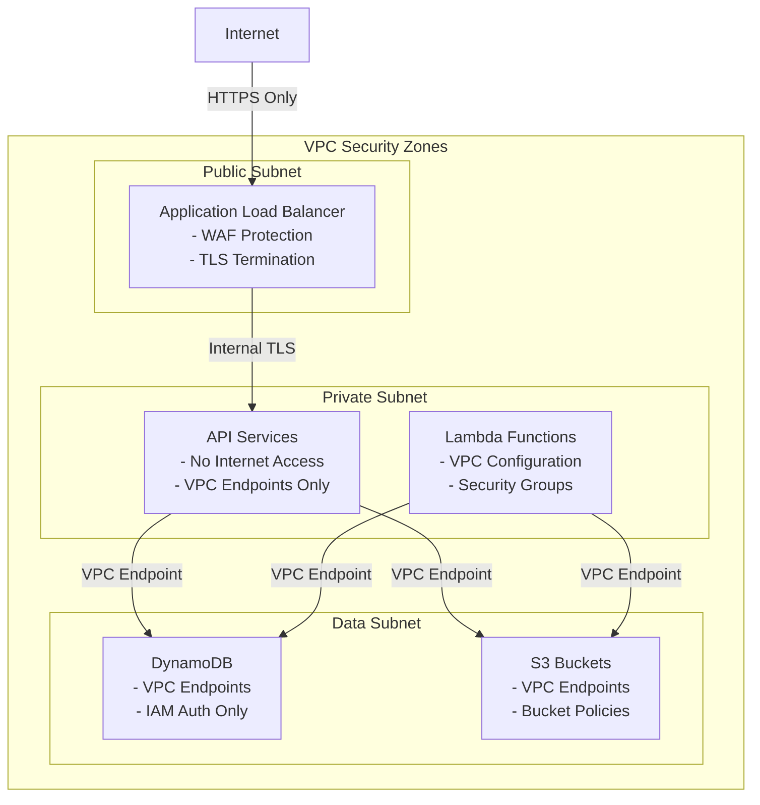

# Security Architecture Diagram

This document illustrates the security-focused architecture of the rosa-log-router multi-tenant logging pipeline, highlighting security boundaries and risk management approaches across the entire system.

## Overview

The rosa-log-router implements a "Centralized Ingestion, Decentralized Delivery" model with strong security isolation between provider infrastructure and customer accounts. The architecture enforces multiple security boundaries to minimize risk exposure and maintain tenant isolation.

## Multi-Account Security Architecture



## Security Boundaries and Risk Management

### 1. Account Boundary (Multi-Tenant Isolation)

**Security Control**: AWS Account separation between provider infrastructure and customer data destinations.

**Risk Mitigation**:
- **Complete tenant isolation** at the AWS account level
- **No shared resources** between customers in different accounts
- **Independent IAM policies** and access controls per customer
- **Separate billing and cost tracking** per customer account

**Implementation**:
- Provider account: `cloudformation/global/central-log-distribution-role.yaml:27`
- Customer accounts: `cloudformation/customer/customer-log-distribution-role.yaml:34`

### 2. Cross-Account Access Boundary (ExternalId Validation)

**Security Control**: Double-hop IAM role assumption with ExternalId validation to prevent confused deputy attacks.



**Risk Mitigation**:
- **ExternalId requirement**: `cloudformation/global/central-log-distribution-role.yaml:47`
- **Prevents confused deputy**: Customer cannot be tricked into granting access to wrong provider
- **Regional role scoping**: `cloudformation/customer/customer-log-distribution-role.yaml:27`
- **Minimal permissions**: CloudWatch Logs only, no other AWS services

**Implementation Details**:
- Central role validation: `container/log_processor.py:781`
- Customer role trust policy: Limited to specific central role ARN with ExternalId

### 3. Kubernetes RBAC Boundary (Container Isolation)

**Security Control**: Role-Based Access Control (RBAC) within Kubernetes clusters to limit component privileges.

**Vector DaemonSet Permissions**:
```yaml
# From k8s/collector/base/vector-clusterrole.yaml
rules:
- apiGroups: [""]
  resources: ["pods", "pods/log", "namespaces"]
  verbs: ["get", "list", "watch"]
- apiGroups: [""]
  resources: ["nodes"] 
  verbs: ["get", "list", "watch"]
```

**Log Processor Permissions**:
```yaml
# From k8s/processor/base/role.yaml
rules:
- apiGroups: [""]
  resources: ["pods", "configmaps", "events"]
  verbs: ["get", "list", "watch", "create", "patch"]
```

**Risk Mitigation**:
- **Least privilege principle**: Each component has minimal required permissions
- **Read-only log access**: Vector can only read pod logs, not modify them
- **No cluster admin**: No component has cluster-wide administrative access
- **SecurityContextConstraints**: OpenShift SCC restrictions for container security

### 4. Data Protection Boundary (Encryption and Partitioning)

**Security Control**: Multi-layer data protection including encryption, tenant partitioning, and access controls.



**Risk Mitigation**:
- **Tenant data isolation**: S3 partitioning by `tenant_id/cluster_id/application/pod_name/`
- **Encryption at rest**: S3 SSE-S3, DynamoDB encryption, EBS encryption
- **Encryption in transit**: TLS for all API calls, encrypted SQS messages
- **Access logging**: CloudTrail for all S3 and IAM operations

**Implementation**:
- S3 partitioning: `container/log_processor.py` S3 key parsing
- DynamoDB schema: `DESIGN.md:57` composite primary key design
- Encryption configuration: CloudFormation templates with default encryption

### 5. API Security Boundary (Authentication and Authorization)

**Security Control**: Multi-layer API security with JWT authentication, tenant-based authorization, and request validation.

**Authentication Flow**:


**Risk Mitigation**:
- **JWT token validation**: Lambda authorizer validates all API requests
- **Tenant-scoped operations**: All API operations filtered by tenant_id
- **Input validation**: Pydantic models for request/response validation
- **Rate limiting**: API Gateway throttling and quotas
- **Request logging**: CloudWatch logs for all API operations

**Implementation**:
- JWT validation: `api/src/handlers/authorizer.py`
- Tenant filtering: `api/src/services/dynamo.py` DynamoDB operations
- Input validation: `api/src/models/` Pydantic models

### 6. Network Security Boundary (VPC and Service Isolation)

**Security Control**: VPC isolation, security groups, and controlled service communication paths.

**Network Architecture**:


**Risk Mitigation**:
- **VPC isolation**: All services deployed in private VPC with no internet access
- **VPC endpoints**: S3, DynamoDB access through VPC endpoints, not internet
- **Security groups**: Restrictive security group rules for service communication
- **WAF protection**: Web Application Firewall for external API access
- **TLS everywhere**: End-to-end TLS encryption for all service communication

## Security Monitoring and Compliance

### Audit Trail

**CloudTrail Monitoring**:
- All IAM role assumptions logged with session names
- S3 object access and cross-account operations tracked  
- API calls with request/response correlation IDs
- DynamoDB operations with tenant context

**Application Logging**:
- Structured logging with tenant_id correlation
- Security events (authentication, authorization failures)
- Cross-account operation success/failure tracking
- Performance metrics with security context

### Compliance Considerations

**Data Residency**:
- Regional deployment isolation
- Customer control over data location
- Cross-region transfer restrictions via IAM policies

**Access Control**:
- Principle of least privilege across all components
- Regular access review through CloudTrail analysis
- Automated credential rotation where possible

**Data Protection**:
- Encryption at rest and in transit
- Tenant data isolation verification
- Secure data deletion capabilities

## Risk Assessment Summary

| Security Boundary | Risk Level | Primary Controls | Monitoring |
|-------------------|------------|------------------|------------|
| Account Separation | Low | AWS Account isolation | CloudTrail, Billing |
| Cross-Account Access | Medium | ExternalId validation, Regional scoping | CloudTrail, Application logs |
| Kubernetes RBAC | Medium | Minimal permissions, SCC | K8s audit logs, Metrics |
| Data Protection | Low | Encryption, Partitioning | S3 access logs, DynamoDB metrics |
| API Security | Medium | JWT auth, Tenant filtering | API Gateway logs, WAF |
| Network Security | Low | VPC isolation, Security groups | VPC flow logs, CloudWatch |

## Related Documentation

- **[System Design](../DESIGN.md)**: Complete architecture overview
- **[Deployment Guide](deployment-guide.md)**: Infrastructure security configuration
- **[Troubleshooting Guide](troubleshooting.md)**: Security-related debugging
- **[Global IAM Role](../cloudformation/global/README.md)**: Central role security model
- **[Customer IAM Role](../cloudformation/customer/README.md)**: Customer-side security setup

## Security Contact

For security-related issues or questions:
1. Review CloudTrail logs for suspicious activity
2. Check application logs for authorization failures
3. Validate IAM role trust relationships and policies
4. Ensure all cross-account operations use proper ExternalId validation